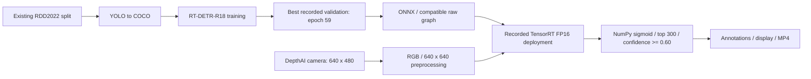

# Road Damage Detection with RT-DETR-R18

Adapted and integrated upstream RT-DETR-R18 / PResNet-18 for five-class road-damage detection and edge deployment. This repository packages selected code, audited results and documentation of a recorded camera demonstration (media excluded). Datasets, checkpoints, ONNX models and TensorRT engines are excluded; this is an engineering evidence package, not a self-contained model distribution.

## System architecture

No NMS is applied in the supplied raw postprocessing path. See [deployment details](docs/05_deployment.md) for evidence qualifications.

## Dataset

38,385 images: 26,869 train, 5,758 validation and 5,758 test; 65,711 valid COCO boxes. Classes: D00 longitudinal crack; D10 transverse crack; D20 alligator/fatigue crack; D40 pothole; Other other road-damage patterns. The existing split's provenance is unknown; the project does not claim to have created it. [Dataset audit](docs/02_dataset.md).

## Model and training

Configured for 72 epochs with AdamW, batch size 8, AMP supported by checkpoint GradScaler state and EMA enabled. Evaluation/deployment use 640 x 640; training includes multiscale resizing. Epoch 59 is the **best recorded validation checkpoint**. Epoch 21's validation log entry is missing. [Training evidence](docs/03_model_and_training.md).

## Results

| Evidence scope | Result | Qualification |
|---|---|---|
| Validation, epoch 59 | mAP50-95 0.3521852248; AP50 0.6454196683 | Best recorded validation entry |
| COCO test-split evaluation artifact | mAP50-95 0.349558240; AP50 0.643720273 | Artifact does not independently bind itself to a checkpoint hash |
| Separate epoch-71 threshold experiment | Precision 77.04%; recall 51.65% | Confidence >= 0.60; matching IoU >= 0.50; not COCO AP |
| Recorded deployment benchmark | 204 frames / 107.825331879 s = 1.891948733 FPS | Time from project summary; frame count directly verified in media |

[Evaluation](docs/04_evaluation.md) and [benchmark scopes](docs/05_deployment.md) keep these experiments separate.

## Deployment

Project records identify Jetson Nano 4GB, TensorRT 8.0.1.6 FP16 and OAK-D RGB camera. Code establishes DepthAI capture and TensorRT runtime calls; hardware identity and precision lack raw device/build logs. Reported file-video throughput is about 2.37 FPS and live processing about 2.2 FPS. The RTX report of 8.11 ms / 123.37 FPS is inference-only, not directly comparable to camera recording throughput.

See [environment notes](environments/environment_notes.md), [tools](tools/README.md) and [Jetson package notes](deployment/jetson/README.md). Preserve the existing engine; no rebuild is required or recommended here.

## Physical demo

Annotated camera demonstration (retained only in the separate staging evidence package, not included in this checkout; **NOT FOR PUBLIC REDISTRIBUTION until image/media rights are reviewed**, excluded from Git by .gitignore): 204 decodable frames, 640 x 480, encoded at 5 FPS (40.8 seconds playback). Playback duration is not acquisition wall time. The camera views images displayed on another screen; this is not real-road field testing. [Media provenance](assets/demo/README.md).

## Project history

The audited RT-DETR-R18 package is the authoritative current project. [Historical RT-DETR-L / YOLOv8-L comparison work](archive/rtdetr-l-vs-yolov8-l/README.md) is preserved separately; its metrics are not a controlled comparison with current R18 results. The repository name retains that historical comparison context.

## Repository structure

- `configs/`, `tools/`: selected configuration and integration snapshots.
- `deployment/jetson/`: TensorRT/DepthAI runtime and recording code.
- `docs/`: lifecycle, verification, limitations and source map.
- `results/`: metrics and recorded benchmark evidence.
- `assets/`: demo provenance and example-selection notes; restricted media excluded.
- `portfolio/`: evidence-grounded career summaries.

## Limitations

Historical qualitative requirements were found in the earlier RT-DETR-L/YOLOv8-L repository. Their chronology relative to experiments is unproven; they contain no numeric latency or accuracy acceptance threshold. [Requirements history](docs/01_problem_and_scope.md).

Class imbalance, weaker Other/small-object AP, unknown split provenance, missing epoch-21 validation, incomplete test/checkpoint linkage and different FPS scopes limit conclusions. No full-dataset TensorRT parity or production-readiness claim is made. [Limitations](docs/07_limitations.md), [future work](docs/08_future_work.md).

## Attribution

RT-DETR is the upstream framework by lyuwenyu and contributors. Project work adapts configuration, evaluation and deployment integration; it does not claim authorship of RT-DETR. [Notices](THIRD_PARTY_NOTICES.md), [source map](docs/SOURCE_MAP.md).

## License

Project-specific original contributions are licensed under [MIT](LICENSE), as selected by the project owner. Upstream RT-DETR-derived material remains subject to [Apache License 2.0](LICENSES/RT-DETR-Apache-2.0.txt); MIT does not relicense that material. See [licensing scope and media restrictions](THIRD_PARTY_NOTICES.md). Neither license grants redistribution rights over third-party datasets or imagery.
